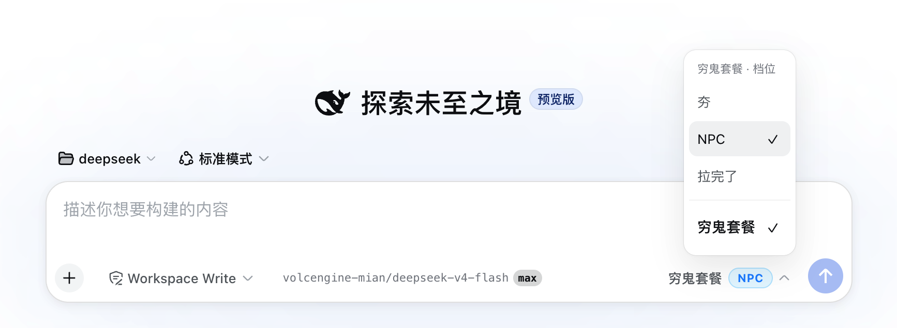
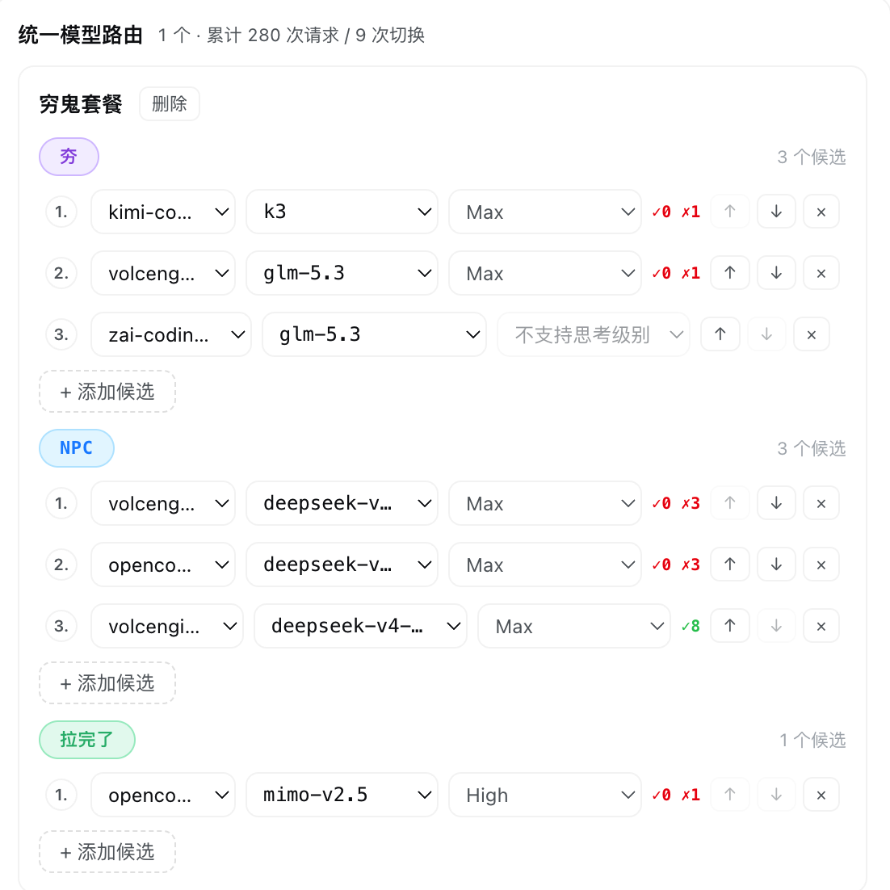

# dsh-model-router

<p align="center">
  
</p>

<p align="center">
  
  
  
  
  
  <a href="https://awesome-dsh-plugin.com"></a>
</p>

> 统一模型路由插件：一个逻辑 **ModelID** 汇聚多家供应商的同名模型，按**套餐**组织候选链（每套餐三档 `tier1/2/3`）——首 token 前失败自动切换并冷却、健康度择优、每候选思考级别；对话窗口可手动选档，设置面板改路由与模型能力**自动保存、即时生效**。
>
> 📦 已发布 npm：[`@welsione/dsh-model-router`](https://www.npmjs.com/package/@welsione/dsh-model-router)

```sh
dsh plugin --profile web add @welsione/dsh-model-router
```

## Screenshots / 界面预览

| 对话窗口 · 套餐与手动档位 | 设置面板 · 路由管理 |
|---|---|
|  |  |

左：对话窗口「套餐 · 档位」选择器——每套餐独立档位名（如 穷鬼套餐：夯 / NPC / 拉完了），点击即可**手动选档**，底部显示当前命中的 `provider/model + 思考级别`。
右：设置页「统一模型路由」管理面板——每套餐候选链 + 每候选**失败/成功计数**（健康度）、思考级别、切换统计（280 请求 · 切 9）、冷却与模型能力编辑，修改自动保存。

## Overview / 简介

| 能力 | 一句话 |
|---|---|
| 多套餐路由 | 多个套餐（Route Group）并存，每套餐独立三档候选链与档位名，按需选用 |
| 自动故障转移 | 主候选首 token 前失败（限流/配额/认证/网络/模型不存在/空响应）自动切下一候选；失败候选**分级冷却**（限流短、服务端中、认证长）+ 连续失败**指数退避**（封顶 30 分钟） |
| 健康度择优 | 候选按滑动窗口**时间衰减 + 错误码加权**评分重排——最近结果权重高，服务端类失败扣分重、限流类轻，稳定成功的提前、频繁失败的延后，可一键关闭 |
| 三档分级 + 手动档位 | 每套餐 `tier1` 轻量 · `tier2` 标准 · `tier3` 强大，按 `purpose` 自动选档、档空逐级降档；对话窗口可**会话级手动选档** |
| 思考级别 | 每候选可配 `reasoningEffort`，保存时实际请求预检，只允许宿主真正支持的档位 |
| 档位名称 | 每套餐独立自定义档位显示名（`routes.<id>.tierNames`），彩色胶囊点击即改名，对话窗口同步展示 |
| 模型能力写回 | 管理面板可编辑自定义供应商模型能力（思考级别档位/contextWindow/maxTokens）并写回宿主 `llm-pi-ai`，热重载生效 |
| 管理面板 | DSH 设置页内置「模型路由」卡片，路由统计/冷却/健康度/能力编辑，修改自动保存；对话窗口套餐选择器实时路由状态 |
| 会话安全 | 会话事件可恢复、跨 provider 自动清洗 `replayState` |

## Compatibility / 兼容性

- DSH `0.1.0-rc.x`（`0.1.0-rc.8` 实测）· Node.js ≥ 22（React 18/19）· 最后验证 2026-08-22。

## Install / Uninstall · 安装 / 卸载

已发布到 npm（`@welsione/dsh-model-router`）。`dsh plugin add` 会自动从 npm 拉取：

```sh
dsh plugin --profile web add @welsione/dsh-model-router   # 安装
dsh plugin --profile web remove @welsione/dsh-model-router  # 卸载
```

> npm 拉不动？可改走 GitHub 源：`dsh plugin --profile web add github:welsione/dsh-model-router`。

装好后设置页出现「模型路由」卡片；对话窗口模型选择器变为「套餐」选择器（三档切换）。详见 [docs/usage.md](docs/usage.md)。

## Quick start / 快速开始

打开 设置 → 模型路由，添加统一 ModelID（如 `deepseek-v4-flash`），为 tier1/2/3 各配候选即可——**修改自动保存、即时生效**。最小配置与完整示例见 [docs/usage.md](docs/usage.md#快速开始)。

## Configuration / 配置

面板可视化编辑 `enabled / cooldownMs / maxSwitchesPerStep / healthRanking / reasoningEffortsFallback / routes`（含每套餐 `tierNames`）。完整配置表、模型能力写回宿主 `llm-pi-ai` 与面板 API 见 [docs/usage.md](docs/usage.md#配置)。

## Permissions & data / 权限与数据

不对外发请求、不读写工作区文件、不上报遥测、不接触 API key；运行时状态为内存态，手动档位持久化到宿主 settings。

## Troubleshooting / 故障排查

设置页无卡片 / 候选不在目录 / 自动保存失败 / 一直切换 / 会话打不开 → 快速排查清单见 [docs/usage.md](docs/usage.md#故障排查)。

## Development / 开发

```sh
npm test                 # 单元测试（node:test，零依赖）
npm test && npm pack --dry-run   # 发布前四连
```

纯逻辑 `lib/core.mjs` + 接线 `lib/index.js` + Web UI `lib/client.js`；合规自检与证据见 [docs/self-check.md](docs/self-check.md)。

### 发布新版本（自动发布到 npm）

打 `v<version>` tag 推送后，GitHub Action（[npm-publish.yml](.github/workflows/npm-publish.yml)）会校验 tag 与 `package.json` 版本一致，然后自动 `npm publish`：

```sh
npm version patch   # 升版本号（patch/minor/major，同步 CHANGELOG）
git push && git push --tags
```

发布需要仓库配置 `NPM_TOKEN` secret（npm 账号 `welsione` 的 Automation token）。

## License & security / 许可证与安全

MIT。安全问题请通过仓库 issue 私下报告。